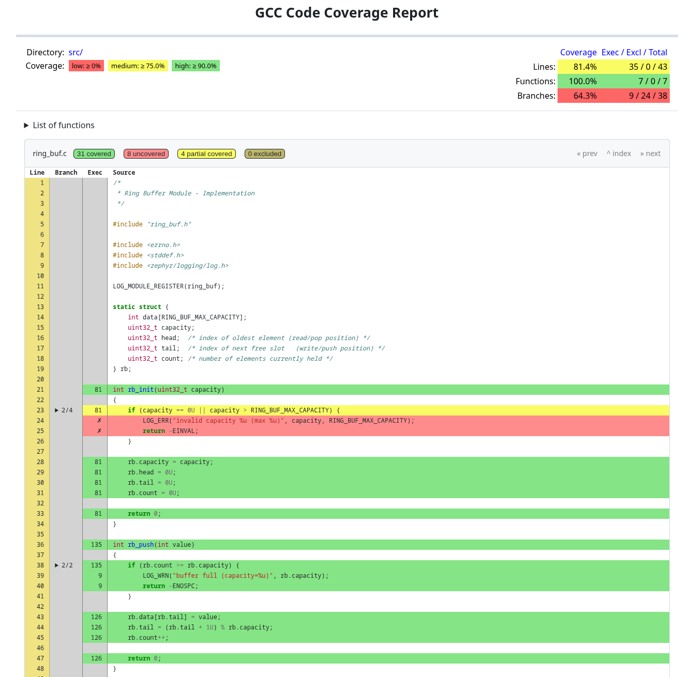

# Zephyr Course — Ivan's Homework Fork

Personal homework fork of the [Iomico Zephyr RTOS course](https://github.com/iomico), targeting the **ESP32-S3 DevKitC** board. Each lecture's completed homework is tagged in git (`l2-task1`, `l6-task2`, etc.) so individual submissions can be reviewed in isolation.

---

## Repo Structure

```
boards/       Custom board definitions (shared across all homework)
drivers/      Out-of-tree Zephyr drivers (spas_driver — lecture 6+)
dts/          Device tree bindings for custom drivers
homework/     One standalone Zephyr app per lecture
modules/      Reusable C modules under test (lecture 8, rebase)
tests/        Ztest unit test suites (lecture 8, rebase)
```

### Folder Modifications

The upstream repo ships a single monolithic `app/` directory. This fork restructures it into a `homework/` layout where each lecture lives as its own standalone Zephyr application with its own `CMakeLists.txt`, `prj.conf`, and overlay. Shared assets — board definitions, the custom driver, DT bindings, and reusable modules — are extracted to dedicated root-level directories so every homework app can reference them without duplication.

---

## Setup

Follow the [Zephyr Getting Started Guide](https://docs.zephyrproject.org/latest/develop/getting_started/index.html) for your OS, completing all steps up to and including **Build the Blinky Sample**.

---

## Homework

### Lecture 1 — What is Zephyr / Preparing the Dev Environment

Set up the Zephyr development environment using West, build the upstream blinky sample, and flash it to the ESP32-S3 to verify the toolchain works end-to-end. 

**Concepts:** West workspace topology, Zephyr SDK, `west build`, `west flash`

---

### Lecture 2 — Meet West, Hello World

**Tag:** `l2-task1`  
**Folder:** `homework/l02_hello_world`

Forked the course workspace, built a blinking LED application, flashed it to hardware, and verified the LED toggles every second. Since ESP32-S3 DevKitC has only WS2812 RGB LED, I implemented control using *worldsemi,ws2812* Zephyr driver and my demo application cycles through red, blue and green colors with a 1s delay.

**Concepts:** West workspace topology, `west build --board`, board-qualified builds, basic GPIO via `gpio_pin_toggle_dt`

---

### Lecture 3 — App Configuration: Kconfig

**Tag:** `l3-task1`  
**Folder:** `homework/l03_app_confg`

Reproduced a multi-level Kconfig menu structure: LED subsystem toggle, blink sleep time choice (120ms / 500ms / 1s / 2s) with a hidden default, and an Expert settings submenu with brightness range (10–100) and fade range (0–100).

WS2812 onboard LED and *worldsemi,ws2812* were used in this demo, so KConfig offers choice of color (only red, green and blue for now). 

Implemented a breathing LED animation that fades to max brightness and back using the Kconfig-defined values.

**Concepts:** `Kconfig`, `menuconfig`, `prj.conf`, `CONFIG_*` symbols, `choice`, `range`, `depends on`, `default`

---

### Lecture 4 — App Configuration: DeviceTree

**Tag:** `l4-task1`  
**Folder:** `homework/l04_device_tree`

Added a configurable heartbeat LED to the blinky app via device tree. The LED GPIO is described in `app.overlay` using the `heartbeat-led` alias. Sleep duration is controlled by `APP_HEARTBEAT_PERIOD_MS` defined in Kconfig and validated through `menuconfig` — changing the period rebuilds correctly and the LED blink speed changes accordingly.

In this lesson i decided to add outboard LED to GPIO pin 10 for heartbeat, this was added in *app.overlay* as *app-led*.

**Concepts:** `app.overlay`, `DT_ALIAS`, `GPIO_DT_SPEC_GET`, `gpio_dt_spec`, Kconfig + DT co-design

---

### Lecture 5 — Custom Boards

**Tags:** `l5-task1`, `l5-task2`  
**Folder:** `homework/l05_custom_boards`

**Task 1:** Created a custom board (`copy_kit`) by copying and adapting an existing ESP32-S3 board definition. Board files live in `boards/copy_kit/` at repo root, referenced via `BOARD_ROOT`.

**Task 2:** Created a second custom board (`from_scratch`) built from the ground up. The hello world sample prints `"Board Initialized!"` before entering `main()` via the board's init hooks.

**Concepts:** `BOARD_ROOT`, `board.yml`, `board.cmake`, `Kconfig.board`, DTS board file structure, board init priority

---

### Lecture 6 — Driver Development

**Tags:** `l6-task1`, `l6-task2`  
**Folder:** `homework/l06_custom_driver`

**Task 1:** Implemented a custom out-of-tree sensor driver (`spas_driver`) that controls an on-board LED. `sensor_sample_fetch` turns the LED on; `sensor_channel_get` turns it off. The driver is registered as a Zephyr module via `ZEPHYR_EXTRA_MODULES` and a `zephyr/module.yml` descriptor.

**Task 2:** Extended the driver with a custom API beyond the standard sensor interface — `spas_get_sleep_time()` and `spas_set_sleep_time()` expose a `sleep_ms` value stored in the driver's mutable data struct, initialized at boot from a DT property.

**Concepts:** `DEVICE_DT_INST_DEFINE`, `DT_DRV_COMPAT`, `dev->config` vs `dev->data`, `GPIO_DT_SPEC_INST_GET`, `DT_INST_PROP`, `DEVICE_API(sensor, ...)`, out-of-tree module with `zephyr/module.yml`, DT bindings YAML

---

### Lecture 7 — Shell Subsystem

**Tags:** `l7-task1`, `l7-task2`  
**Folder:** `homework/l07_shell`

**Task 1:** Wired the lecture 6 sensor driver into the Zephyr shell subsystem. Added a `sensor` root command with three subcommands: `fetch` (calls `sensor_sample_fetch`), `read` (calls `sensor_channel_get` and prints the value), and `info` (prints device name and ready state).

**Task 2:** Exposed the custom `spas_set_sleep_time` extension API as a shell subcommand — `sensor set <ms>`. The command validates its argument: rejects non-numeric input and out-of-range values via `shell_error`, with argument count enforced by `SHELL_CMD_ARG`.

**Concepts:** `SHELL_STATIC_SUBCMD_SET_CREATE`, `SHELL_CMD`, `SHELL_CMD_ARG`, `SHELL_CMD_REGISTER`, `shell_print`, `shell_error`, argument validation with `strtol`

---

### Lecture 8 — Unit Testing

**Tags:** `l8-task1`, `l8-task2`  
**Folder:** `tests/ring_buf`

**Task 1:** Implemented 7 Ztest bodies for the `ring_buf` module — a circular FIFO buffer. Tests cover: fresh state after init, re-init clearing state, single push/pop round-trip, FIFO ordering, overflow returning `-ENOSPC`, peek-without-consume semantics, `NULL` pointer rejection, and full-buffer detection.

```
west twister -T tests/ring_buf -p native_sim
```

**Task 2:** Generated a code coverage report for the `ring_buf` module and verified expected coverage: lines 100%, functions 100%, branches ~69%.

```
west twister -T tests/ring_buf -p native_sim --coverage --coverage-tool lcov
```

**Concepts:** `ZTEST`, `ZTEST_SUITE`, `zassert_ok`, `zassert_equal`, `zassert_true`, `before` hook, `native_sim` platform, Twister test runner, lcov coverage

